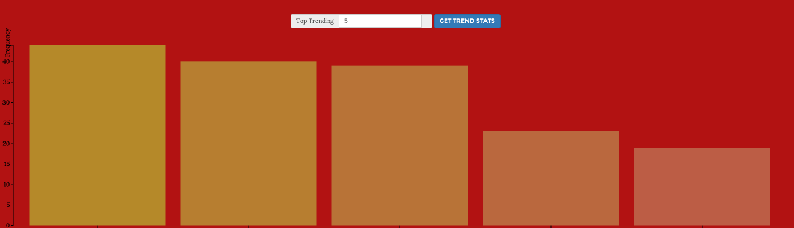
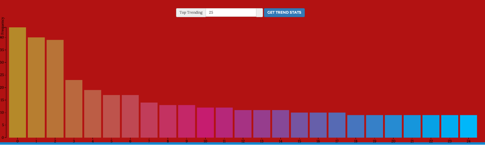
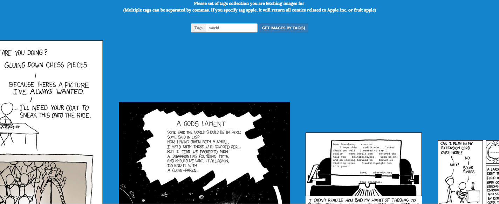
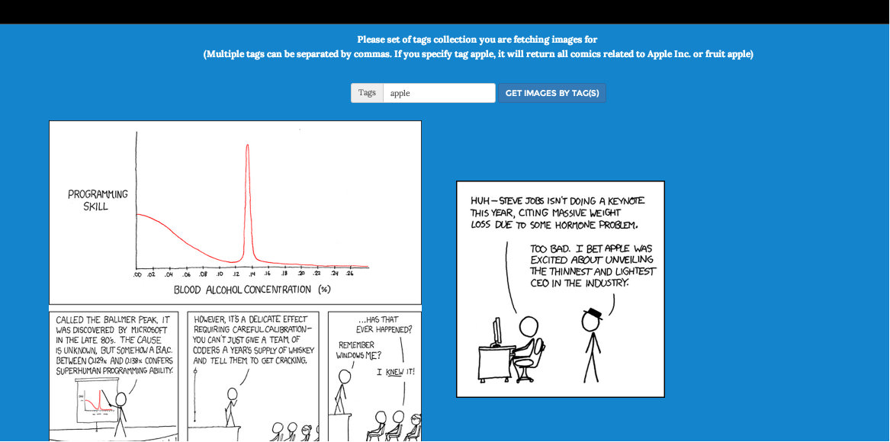

<h2>XKCD Web Application </h2>

<i><b>
(Disclaimer : All comics are sourced from http://www.xkcd.com. I do not claim any ownership of them. They are property of respective author(s)) 
</i></b>

This is the simple project built using PHP, MySQL and Angular JS to interactively view selection of xkcd comics.

<b>To summarize, it offers three features : </b>

1. Summarize the top n tags used in overall 1450+ xkcd comics published so far
2. Output the comics based on the input value of tag(s) by user. (User can specify multiple tags separated by ','. Tags separated by any other punctuation character will not be recognized and will be assumed to be the whole word)
3. Output the comics based on the range of input comic sequence

Application used Angular JS as front end framework and back end is built using PHP and MySQL database. I have also used D3 library for interactive data visualization and bootstrap for CSS decoration. 

I could not think of any other feature(s) to add to this version in addition to what we already have so far. If you have any idea, let me know. If you find any bug or performance issues in current version, let me know. I will be more than happy to fix them at my earliest convenience.

Below are some of the awesome screen shots of this app. In the meantime you can also experience the app by visiting URL on the top of this page

<li>
<ol> Top trending tags (Top 5 list) </ol>

<ol> Top trending tags (Top 25 list) </ol>

<ol> Comics by input tag </ol>

<ol> Comics by input tags with different search parameter </ol>

<ol> Comics by input sequence range </ol>

</li>

<b>Feedback / suggestions / criticism are welcome as usual! </b>
Tip : Please make sure to run http://jayeshkawli.com/xkcdapp/xkcdcomics.php periodically to refresh the database entries for latest comics collection. Otherwise some recent comics won't be available in the database
